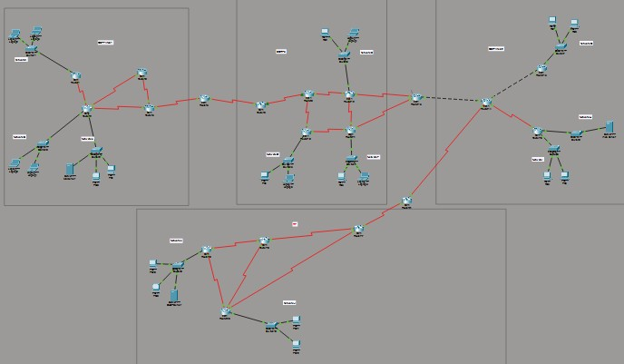

# Enterprise Network Simulation

## Project Overview
A multi-domain enterprise network designed and simulated in Cisco Packet Tracer for a Computer Networks university course. The topology spans 19 routers and 57 links divided into four routing domains (OSPF Area 1, EIGRP AS 5, OSPF Area 2, and RIP v2), interconnected through route redistribution at three boundary routers. Addressing for all LANs and WAN links was planned manually with VLSM from a single /10 pool, and the network includes NAT, ACL-based access restrictions, centralized DHCP with relay across domains, and a working SMTP/POP3 mail service.

The full design document with verification outputs is in `docs/Project_Report.pdf`, and the simulation itself is `network.pkt`.

## Routing Domains

| Domain | Protocol | Routers | LAN Networks |
|--------|----------|---------|--------------|
| Block 1 | OSPF Area 1 | R0, R1, R2, R3, R5 | A, B, C |
| Block 2 | EIGRP AS 5 | R5, R8, R9, R10, R11, R12, R13 | D, E, F |
| Block 3 | OSPF Area 2 | R13, R14, R15, R16, R21 | G, H, I |
| Block 4 | RIP v2 | R17, R18, R19, R20, R21 | J, K |

Redistribution boundaries:
- Router5 — OSPF Area 1 <-> EIGRP AS 5
- Router13 — EIGRP AS 5 <-> OSPF Area 2
- Router21 — OSPF Area 2 <-> RIP v2

Each boundary router runs both protocols and redistributes routes in both directions, so every host can reach every network regardless of domain. Cross-domain reachability was verified with pings traversing all four domains (e.g. a Network B host reaching the DHCP server in Network K crosses OSPF Area 1 -> EIGRP -> OSPF Area 2 -> RIP).

## VLSM Addressing Plan
All subnets were carved from 146.128.0.0/10, allocated largest-first to minimize waste. Host requirements per subnet ranged from ~11,000 to ~100,000, which pushed the larger networks to /15 masks.

| Net | Hosts Required | Subnet | Mask |
|-----|----------------|--------|------|
| I | 99,877 | 146.128.0.0/15 | 255.254.0.0 |
| C | 99,001 | 146.130.0.0/15 | 255.254.0.0 |
| F | 77,889 | 146.132.0.0/15 | 255.254.0.0 |
| K | 77,665 | 146.134.0.0/15 | 255.254.0.0 |
| H | 66,554 | 146.136.0.0/15 | 255.254.0.0 |
| B | 55,667 | 146.138.0.0/16 | 255.255.0.0 |
| E | 44,556 | 146.139.0.0/16 | 255.255.0.0 |
| J * | 33,445 | 158.16.0.0/16 (private) | 255.255.0.0 |
| G | 33,221 | 146.141.0.0/16 | 255.255.0.0 |
| D | 22,344 | 146.142.0.0/17 | 255.255.128.0 |
| A | 11,234 | 146.142.128.0/18 | 255.255.192.0 |

\* Network J uses private address space because NAT is configured on Router20.

All 23 router-to-router WAN links use /30 subnets (2 usable addresses each) allocated sequentially from 146.142.192.0.

## Key Implementations

### NAT (Router20)
Network J runs on private space 158.16.0.0/16. Router20 translates outbound traffic to the assigned public IP 146.137.52.59, with FastEthernet0/0 as the inside interface and all three serial links as outside interfaces. Verified with `show ip nat translations`.

### Access Control Lists
Two restrictions protect the web server (146.136.0.2) as required:
- One host in Network A (146.142.128.3) is denied access — ACL `BLOCK_A` applied inbound on Router1 Fa0/0. The other Network A hosts still reach the server normally.
- The entire Network D subnet (146.142.0.0/17) is denied access — ACL `BLOCK_D` applied inbound on Router10 Fa0/0.

Both were verified with ping tests: blocked hosts get "Destination host unreachable" from their gateway while permitted hosts receive replies.

### Centralized DHCP with Relay
A single DHCP server (146.134.0.2, Network K) serves hosts in three different routing domains. Since DHCP discover messages are broadcasts and don't cross routers, `ip helper-address 146.134.0.2` was configured on every LAN-facing router interface in networks A–F and J, turning the broadcasts into unicasts that get routed to the server. Each network has its own pool with the correct gateway and mask. OSPF Area 2 hosts and all servers use static addressing.

### Email Service
The mail server (146.130.0.2, Network C) runs SMTP and POP3 with domain mail.com, plus a DNS A record resolving mail.com to itself. All Block 1 hosts have accounts and can send and receive mail to each other, verified end to end with the Packet Tracer mail client.

## Repository Structure

| Path | Contents |
|------|----------|
| `network.pkt` | The Packet Tracer simulation file |
| `topology.png` | Exported topology diagram |
| `configs/` | `show running-config` output of each router as plain text |
| `screenshots/` | Verification screenshots (neighbors, routing tables, NAT, ACL tests, email) |
| `docs/Project_Report.pdf` | Full design and verification report |

## Opening the Simulation
The `.pkt` file requires Cisco Packet Tracer 8.x (free with a Cisco Networking Academy account). Open it, wait for the protocols to converge (about a minute), and all 57 links should show green. The router configs in `configs/` can be read without Packet Tracer.
